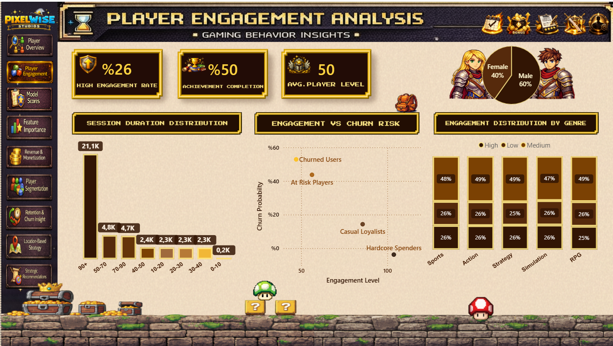
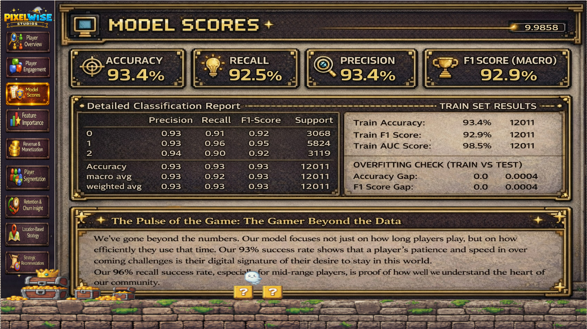
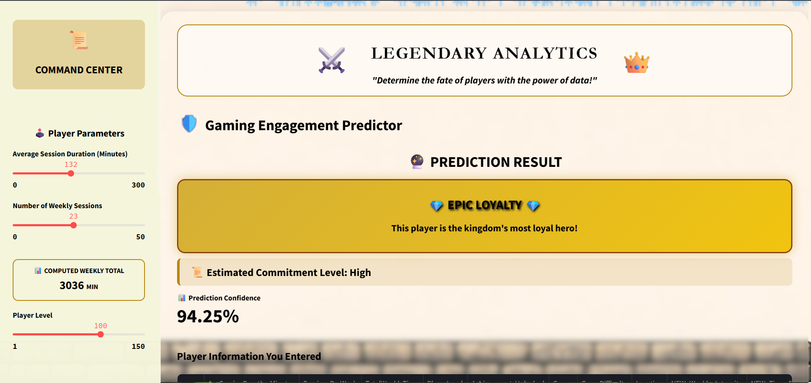
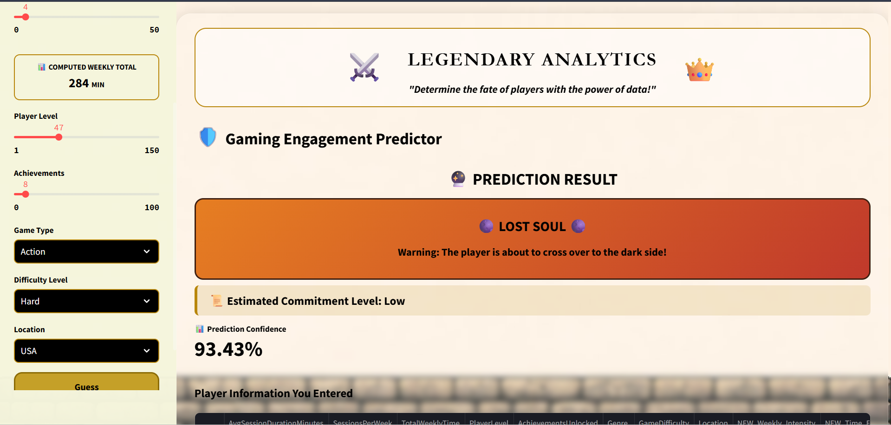

🎮 PixelWise: Uçtan Uca Oyun Analitiği ve Prediktif Modelleme
📌 Proje Özeti
PixelWise, modern oyun endüstrisindeki en büyük problemlerden biri olan oyuncu tutundurma (retention) ve davranış öngörüsü üzerine kurgulanmış veri analitiği ve  veri bilimi projesidir. gamingbehaviordb data setinde  40.000 +  oyuncuların demografik verileri, oyun içi metrikleri ve harcama alışkanlıkları vb. analiz edilerek; oyuncuların bağlılık seviyelerini tahmin eden ve stratejik karar destek sağlayan bir yapı inşa edilmiştir.

🔍 1. Keşifçi Veri Analizi (EDA) ve Veri Madenciliği
Ham veri üzerinde gerçekleştirilen derinlemesine analizlerle oyuncu ekosistemi anlamlandırılmıştır:

Korelasyon Analizi: Oyun süresi ile harcama alışkanlıkları arasında pozitif bir korelasyon saptanmış, ancak belirli bir seviyeden sonra "harcama yapmayan ama sadık" (Loyal Free-to-Play) bir kitle olduğu keşfedilmiştir.

Demografik Dağılım: Oyuncu kitlesinin yaş, cinsiyet ve bölge bazlı dağılımları incelenerek; hedef pazar stratejileri oluşturulmuştur.

Bölgesel Performans: USA, Europe ve Asia bölgeleri arasında "Gelir Per-Capita" ve "Etkileşim Oranı" (Engagement Rate) farklılıkları saptanmış, lokasyon bazlı kampanya önerileri geliştirilmiştir.

💡 Stratejik Aksiyon Planı,🌍 Bölgesel Pazar Analizi,🔄 Bağlılık & Churn Analitiği
,,
Stratejik Öneriler,Bölgesel Analiz,Retention & Churn

🎯 2. Segmentasyon ve İçgörü Geliştirme
Oyuncular sadece veriye göre değil, davranışsal motivasyonlarına göre segmente edilmiştir:
Hardcore Spenders: Yüksek harcama ve yüksek oyun süresine sahip, ana gelir kaynağı olan kitle.
Casual Loyalists: Düşük harcama yapan ama her gün giriş yapan, topluluk etkileşimini yüksek tutan kitle.
At-Risk Explorers: Seviye ilerlemesi yavaşlamış ve oyunu bırakma eğilimi (Churn) gösteren riskli grup.
New Starters: İlk 7 günlük etkileşimi kritik olan, onboarding sürecindeki yeni kullanıcılar.

🤖 3. Makine Öğrenmesi (Modelleme Süreci)
Projenin kalbi olan tahminleme aşamasında birden fazla algoritma yarıştırılmıştır.

Uygulanan Adımlar:
Feature Engineering: Mevcut verilerden "Bağlılık Skoru" ve "Harcama Yoğunluğu" gibi yeni değişkenler türetilmiştir.
Model Seçimi: LightGBM, XGBoost ve CatBoost algoritmaları test edilmiş; en iyi sonuç LightGBM ile alınmıştır.
Hyperparameter Optimization: GridSearchCV ve Optuna yöntemleriyle modelin hiperparametreleri optimize edilmiştir.
Değişken Önem Düzeyi (Feature Importance): Modelin kararlarını en çok etkileyen faktörlerin "Seviye İlerleme Hızı" ve "Oyun İçi Etkinlik Katılımı" olduğu saptanmıştır.

Başarı Metrikleri:
Accuracy: %93.4
AUC: %98.6
F1-Score: Dengeli bir hassasiyet ve geri çağırma oranı sağlanmıştır.

🖥️ 4. Veri Ürünü: İnteraktif Arayüz (UI)
Analizlerin sadece raporlarda kalmaması için bir Web Arayüzü geliştirilmiştir.
Canlı Tahminleme: İş birimleri, oyuncu metriklerini (yaş, harcama, oyun süresi vb.) sisteme girdiğinde, model anlık olarak bu oyuncunun "High", "Medium" veya "Low" bağlılık seviyesinde olduğunu tahmin eder.

### 📊 Proje Analiz ve Modelleme Sonuçları

| 🎮 Oyuncu Bağlılık Analizi | 📈 Model Başarı Skorları |
| :---: | :---: |
|  |  |
| *Bağlılık Dağılımı* | *Model Başarı Skorları* |
| **🔍 Canlı Test: Yüksek Bağlılık** | **⚠️ Canlı Test: Churn Riski** |
|  |  |
| *Canlı Tahminleme (High)* | *Canlı Tahminleme (Churn)* |

📊 5. Stratejik Karar Destek Dashboardları (Power BI)
Yönetici özeti tadında hazırlanan dashboardlarda şu içgörüler sunulmaktadır:
Monetization Analysis: Hangi oyun içi ürünlerin hangi bölgede daha çok sattığı.
Retention Tracking: Seviye bazlı oyuncu dökülme oranları.
Engagement Heatmaps: Günlük ve haftalık aktif kullanıcı (DAU/WAU) trendleri.

🛠️ Teknoloji Seti
Diller: Python (Pandas, Numpy, Scikit-learn, Scipy)
Algoritmalar: (LightGBM) , XGBoost, CatBoost
Veritabanı & Sorgulama: SQL, Excell
Görselleştirme: Power BI, Seaborn, Matplotlib
Ürünleştirme: Streamlit

📁 Dosya Yapısı
├── Source_Code/
│   ├── Gaming_Analitc-Model.ipynb  # Veri Ön İşleme ve ML Modelleme
│   ├── Model_(UI).py            # Web Arayüzü Kodları
│   └── requirements.txt            # Kütüphane Listesi
│   └── Background picture.jpeg
├── Presentation_and_Visuals/
│   ├── .png
│   ├── .png
└── README.md

Nasıl Kullanılır?
Repoyu klonlayın.

pip install -r Source_Code/requirements.txt komutuyla kütüphaneleri yükleyin.
Notebook dosyasını çalıştırarak analiz adımlarını takip edin.
